# HerdDB Checkpoint System

This document describes how checkpointing works in HerdDB — what it does, when it runs, how
the various phases interact with concurrent DML, and how it differs across index types and
storage/commit-log backends.

---

## Table of Contents

1. [Purpose](#1-purpose)
2. [Tablespace-level Checkpoint (TableSpaceManager)](#2-tablespace-level-checkpoint-tablespacmanager)
3. [Table-level Checkpoint (TableManager)](#3-table-level-checkpoint-tablemanager)
   - [Phase A — Metadata snapshot (brief write lock)](#phase-a--metadata-snapshot-brief-write-lock)
   - [Phase B — Heavy work (no lock)](#phase-b--heavy-work-no-lock)
   - [Phase C — Finalise (brief write lock)](#phase-c--finalise-brief-write-lock)
4. [Page Lifecycle During Checkpoint](#4-page-lifecycle-during-checkpoint)
5. [Index Checkpoints](#5-index-checkpoints)
   - [BLink Primary-Key Index](#blink-primary-key-index)
   - [MemoryHash Secondary Index](#memoryhash-secondary-index)
   - [BRIN Secondary Index](#brin-secondary-index)
   - [Vector (HNSW) Secondary Index](#vector-hnsw-secondary-index)
6. [Concurrency Model and Race-Condition Handling](#6-concurrency-model-and-race-condition-handling)
7. [Checkpoint Timing Metrics](#7-checkpoint-timing-metrics)
8. [Dump TableSpace (Replica Bootstrap)](#8-dump-tablespace-replica-bootstrap)
9. [CommitLog Backend Differences](#9-commitlog-backend-differences)
10. [DataStorage Backend Differences](#10-datastorage-backend-differences)
11. [Recovery After Checkpoint](#11-recovery-after-checkpoint)
12. [Pinned Checkpoints](#12-pinned-checkpoints)

---

## 1. Purpose

A checkpoint is a consistent snapshot of an in-memory table written to durable storage.
After a successful checkpoint, recovery only needs to replay the write-ahead log (WAL) from
the checkpoint's `LogSequenceNumber` (LSN) onwards — everything before that LSN is already
safely on disk.

Checkpoints serve three goals:

| Goal | Mechanism |
|------|-----------|
| Bounded recovery time | Only log entries after the checkpoint LSN need replay |
| Memory reclamation | Dirty/small pages are compacted and their memory released |
| Old-ledger cleanup | The commit-log leader deletes ledger files older than the checkpoint LSN |

Checkpoints are triggered:
- Periodically by `DBManager`'s checkpoint thread
- Explicitly by tests or management APIs
- Automatically during a full table-space dump (for replica bootstrap)

---

## 2. Tablespace-level Checkpoint (TableSpaceManager)

```mermaid
flowchart TD
    START([checkpoint called]) --> VIRTUAL{virtual\ntablespace?}
    VIRTUAL -->|yes| SKIP([return null])
    VIRTUAL -->|no| RECOVERY{recovery\nin progress?}
    RECOVERY -->|yes| SKIP2([return null — log SKIP])
    RECOVERY -->|no| MUTEX{checkpointMutex\ntryLock?}
    MUTEX -->|fails — another checkpoint running| SKIP3([return null — log SKIP])
    MUTEX -->|acquired| WRITE_LOCK[Acquire generalLock\nwrite lock]

    subgraph PHASE_A["Phase A (brief write lock — DML blocked)"]
        WRITE_LOCK --> LSN[Capture logSequenceNumber\nfrom CommitLog]
        LSN --> CHECK_SOT{isStartOfTime?}
        CHECK_SOT -->|yes| EARLY_EXIT([return early — nothing to checkpoint])
        CHECK_SOT -->|no| TX[Snapshot active transactions\nvalidate LSN ordering]
        TX --> WRITE_TX[writeTransactionsAtCheckpoint\nto DataStorageManager]
        WRITE_TX --> WRITE_TABLES[writeTablesOnDataStorageManager\nschema + index metadata]
        WRITE_TABLES --> SNAP[Snapshot tables list →\ntablesToCheckpoint]
        SNAP --> RELEASE_WRITE[Release generalLock write lock]
    end

    RELEASE_WRITE --> DML_RESUMES[/"DML can proceed from here"/]

    subgraph PHASE_B["Phase B (no tablespace lock — DML concurrent)"]
        DML_RESUMES --> FOR_EACH_TABLE[For each table in tablesToCheckpoint]
        FOR_EACH_TABLE --> IS_SYSTEM{isSystemTable?}
        IS_SYSTEM -->|yes| NEXT_TABLE[next table]
        IS_SYSTEM -->|no| TABLE_CP[tableManager.checkpoint\nor fullCheckpoint]
        TABLE_CP --> TRY_CATCH{Exception?}
        TRY_CATCH -->|dropped during checkpoint| WARN[log WARNING — skip table]
        TRY_CATCH -->|ok| HOOK[afterTableCheckPointAction.run\ntest hook]
        HOOK --> NEXT_TABLE
        WARN --> NEXT_TABLE
        NEXT_TABLE --> MORE{more tables?}
        MORE -->|yes| FOR_EACH_TABLE
        MORE -->|no| WRITE_CP_SEQ[writeCheckpointSequenceNumber\nto DataStorageManager]
    end

    subgraph PHASE_C["Phase C (no tablespace lock)"]
        WRITE_CP_SEQ --> DROP_LEDGERS[leader: log.dropOldLedgers\nlogSequenceNumber]
        DROP_LEDGERS --> POST_ACTIONS[Execute PostCheckpointActions\nclean up old pages/files]
    end

    POST_ACTIONS --> UNLOCK_MUTEX[checkpointMutex.unlock]
    UNLOCK_MUTEX --> RETURN([return TableSpaceCheckpoint])
```

### Key locks

| Lock | Type | Held during | Blocks |
|------|------|-------------|--------|
| `checkpointMutex` (ReentrantLock) | exclusive | entire checkpoint | concurrent `checkpoint()` calls (they skip) |
| `generalLock` (StampedLock write) | write | Phase A only (~ms) | all DML reads and writes |

After Phase A releases the `generalLock`, DML operations (INSERT / UPDATE / DELETE / SELECT)
proceed freely while the table checkpoints run — which is the expensive part.

DDL (CREATE/DROP TABLE/INDEX) uses `generalLock` write as well. A DDL that races with
the checkpoint can:
- **Create a table** after the Phase A snapshot → table not in `tablesToCheckpoint`, its
  log entries are replayed from the checkpoint LSN on recovery.
- **Drop a table** between Phase A and Phase B → `tableManager.checkpoint()` throws;
  caught by the try/catch, logged as WARNING, table skipped.

---

## 3. Table-level Checkpoint (TableManager)

Each `TableManager.checkpoint()` call has its own three-phase structure, driven by an
internal `checkpointLock` (StampedLock). DML operations acquire a read lock on
`checkpointLock`; checkpoint phases A and C acquire the write lock briefly.

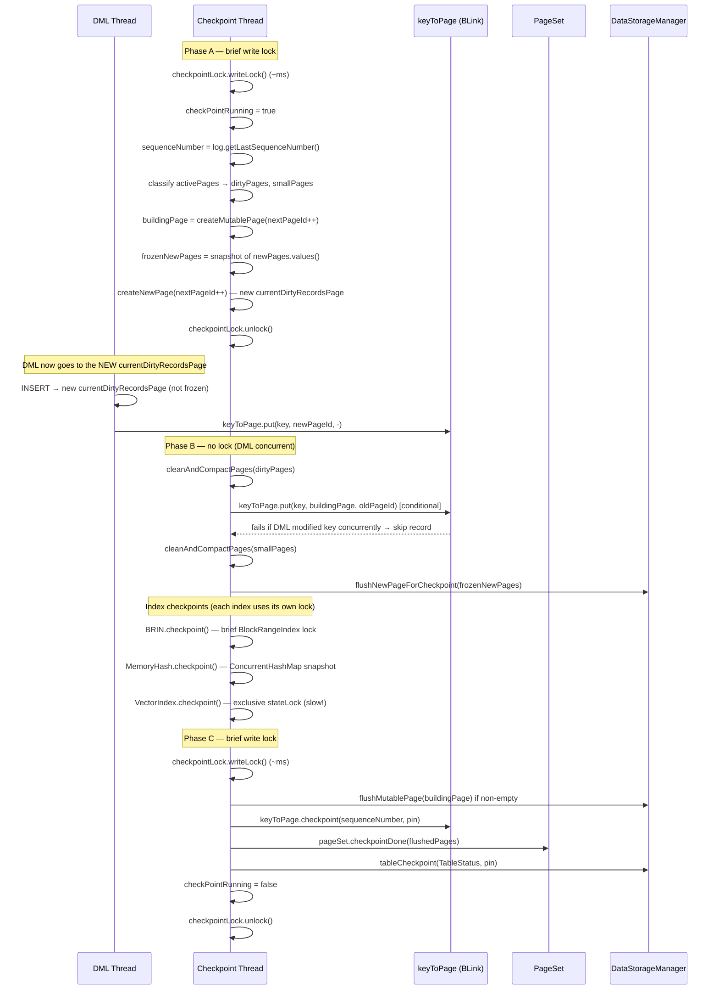

### Phase A — Metadata snapshot (brief write lock)

Duration: typically a few milliseconds.

1. Acquire `checkpointLock` write lock (waits for in-flight DML reads to finish).
2. Set `checkPointRunning = true`.
3. Capture `sequenceNumber = log.getLastSequenceNumber()`. This LSN becomes the
   table's checkpoint LSN — the point from which recovery will replay.
4. Analyse `pageSet.getActivePages()`:
   - Pages with `dirt >= dirtyPageThreshold` → `flushingDirtyPages` (sorted by dirt, desc).
   - Pages with `size <= fillPageThreshold` → `flushingSmallPages` (sorted by size, asc).
5. Allocate a fresh `buildingPage = createMutablePage(nextPageId++, 0, 0)` for compaction output.
6. Freeze: `frozenNewPages = new ArrayList<>(newPages.values())`. From now on these pages
   will receive no more inserts.
7. Rotate: `createNewPage(nextPageId++)` — installs a brand-new mutable page as
   `currentDirtyRecordsPage`. All DML that arrives during Phase B is directed here.
8. Release write lock. **DML resumes immediately.**

> **Why `nextPageLock` matters**: Both Phase A (`nextPageId++`) and `allocateLivePage`
> (called by concurrent DML to open a new mutable page) increment `nextPageId`. Both
> paths are guarded by `nextPageLock` (ReentrantLock) to prevent duplicate page IDs.

### Phase B — Heavy work (no lock)

This is where all the time is spent. No `checkpointLock` is held; DML reads and writes
proceed freely.

#### Dirty-page compaction

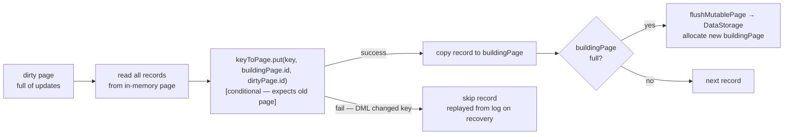

For **clean-page compaction** (small pages), if the conditional put fails it means
concurrent DML modified that record. The entire page's compaction is aborted for this
checkpoint cycle (logged at INFO). The page stays as-is and will be considered again on
the next checkpoint.

#### Frozen new-page flush

Each `frozenNewPage` is passed to `flushNewPageForCheckpoint()`:
- **Non-empty page**: written to `DataStorageManager`, converted to an immutable page, added
  to `pageSet`.
- **Empty page** (e.g. the page that was `currentDirtyRecordsPage` before Phase A rotated it
  out, if no inserts had arrived yet): `EMPTY_FLUSH` — the page is removed from `pages`
  and from the `PageReplacementPolicy` without any disk write.

#### Secondary index checkpoints

Each secondary index's `checkpoint()` method is called here, while the table holds no lock.
Every index type manages its own internal synchronisation (described in
[§5](#5-index-checkpoints)).

### Phase C — Finalise (brief write lock)

Duration: typically a few milliseconds.

1. Acquire `checkpointLock` write lock again.
2. Flush `buildingPage` if non-empty → immutable page on disk.
3. `keyToPage.checkpoint(sequenceNumber, pin)` — checkpoints the BLink primary-key index.
   This requires the write lock because BLink's checkpoint iterates the tree expecting no
   concurrent structural modifications.
4. `pageSet.checkpointDone(flushedPages)` — removes compacted page IDs from `activePages`.
5. `dataStorageManager.tableCheckpoint(TableStatus, pin)` — persists the `TableStatus`
   record (LSN, active pages, next page ID, next primary-key value).
6. Set `checkPointRunning = false`.
7. Release write lock.

---

## 4. Page Lifecycle During Checkpoint

```mermaid
stateDiagram-v2
    [*] --> Mutable: createMutablePage / createNewPage
    Mutable --> Frozen: Phase A — frozenNewPages snapshot
    Mutable --> Current: Phase A — new currentDirtyRecordsPage
    Current --> Frozen: next checkpoint's Phase A
    Frozen --> Immutable: flushNewPageForCheckpoint (non-empty)
    Frozen --> Gone: flushNewPageForCheckpoint (empty) → EMPTY_FLUSH
    Immutable --> Gone: PostCheckpointAction — old page removed after pin released
    Immutable --> Unloaded: PageReplacementPolicy eviction
    Unloaded --> Immutable: loaded on demand from DataStorage

    note right of Frozen: No new DML arrives here;\nPhase B flushes it to disk
    note right of Current: DML during Phase B goes here;\nwill be frozen in next checkpoint
```

A `DataPage` transitions:
- **Mutable** → actively written by DML inserts.
- **Frozen** → snapshot taken in Phase A; no more inserts; will be flushed in Phase B.
- **Immutable** → on disk; can be loaded/unloaded by the `PageReplacementPolicy`.
- **Gone** → removed from `pages` map and from `PageReplacementPolicy`.

---

## 5. Index Checkpoints

### BLink Primary-Key Index

The BLink tree (`BLinkKeyToPageIndex`) maps primary keys → page IDs. It is checkpointed in
**Phase C** under the `checkpointLock` write lock.

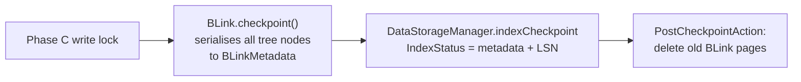

**Why Phase C?** The BLink checkpoint serialises the entire tree structure. It requires
no concurrent structural modifications (key inserts/deletes during serialisation would
invalidate the serialised state). The write lock guarantees this. Because BLink is a
B-tree-like structure with per-node read/write locks, its checkpoint is relatively fast.

**DML interaction**: Key inserts/deletes happen under the DML read lock on `checkpointLock`,
so they cannot overlap with Phase C.

---

### MemoryHash Secondary Index

`MemoryHashIndexManager` stores a `ConcurrentHashMap<Bytes, List<Bytes>>` (index key →
list of primary keys). It is checkpointed during **Phase B** (no table lock held).

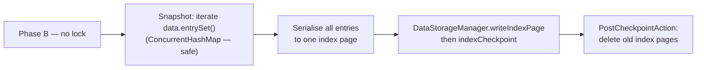

**DML interaction**: `recordInserted` / `recordDeleted` / `recordUpdated` use
`ConcurrentHashMap.merge()` and `compute()`, which are thread-safe. The checkpoint
iterates the map snapshot; concurrent DML may add/remove entries, but the result is
still consistent because:
- Inserts after the Phase A LSN will be replayed from the WAL on recovery.
- The serialised snapshot represents the index state at approximately the checkpoint LSN.

**Performance**: Fast — single pass over an in-memory map, serialised to one page.

---

### BRIN Secondary Index

`BRINIndexManager` wraps a `BlockRangeIndex<Bytes, Bytes>` (a range-segmented in-memory
structure). It is checkpointed during **Phase B**.

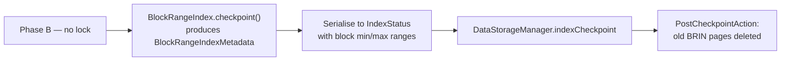

**DML interaction**: `recordInserted` / `recordDeleted` / `recordUpdated` acquire the
`BlockRangeIndex`'s internal lock briefly. DML on indexed columns will briefly block
while `BlockRangeIndex.checkpoint()` holds its own internal lock, but this is not the
table's `checkpointLock` — unrelated DML proceeds freely.

**Performance**: Fast to moderate — proportional to the number of distinct value ranges.

---

### Vector (HNSW) Secondary Index

`VectorIndexManager` stores an approximate nearest-neighbour (ANN) graph using the HNSW
algorithm. Its checkpoint is the most expensive operation in the system.

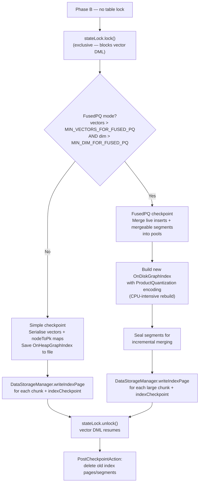

**DML interaction with `stateLock`**:

`recordInserted`, `recordDeleted`, `recordUpdated` acquire `stateLock` before modifying
the graph builder's internal data structures (`vectors`, `pkToNode`, `nodeToPk`). This
means:

- **DML on vector-indexed columns is blocked** while the vector index is being
  checkpointed.
- **DML on non-vector columns** (columns not in the vector index) is completely unaffected.
- Because the vector index checkpoint runs in Phase B (after `checkpointLock` is released),
  blocking vector DML does **not** affect the tablespace-level lock or other tables.

**Why FusedPQ is slow**:

| Step | Cost |
|------|------|
| Load all vectors from disk/memory segments | I/O bound |
| ProductQuantization codebook training | CPU-intensive (k-means) |
| Build OnDiskGraphIndex (HNSW graph) | O(N log N) comparisons |
| Serialise graph in binary format | I/O bound for large graphs |

For 50 M vectors at 128 dimensions this can take minutes.

**Simple checkpoint** (small indexes) serialises `vectors` and `nodeToPk` maps directly
and saves the `OnHeapGraphIndex` binary format. It is much faster.

---

## 6. Concurrency Model and Race-Condition Handling

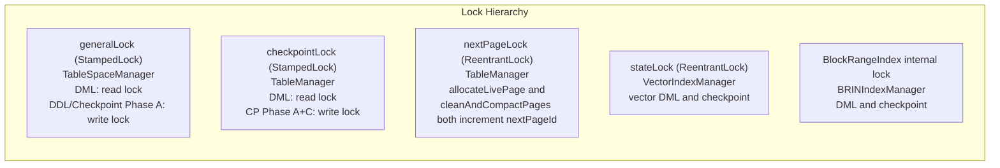

### Conditional keyToPage update

The core mechanism preventing data loss during compaction is the **conditional put**:

```
boolean handled = keyToPage.put(key, newBuildingPageId, expectedOldPageId);
if (!handled) {
    // A concurrent UPDATE or DELETE changed this record's page mapping.
    // Skip the record — it will be replayed from the WAL on recovery.
}
```

This is safe because:
1. The WAL contains every DML operation since the last checkpoint.
2. Recovery replays all WAL entries after the checkpoint LSN.
3. A skipped record means the compacted page does **not** include it; the record will be
   re-applied during recovery from the WAL, landing in the new `currentDirtyRecordsPage`.

### Clean-page compaction abort

If a conditional put fails while compacting a **clean** page (one that wasn't dirty before
Phase A), the entire compaction of that page is aborted for this checkpoint cycle. The page
is removed from `flushedPages` and remains in `pageSet.activePages` for the next
checkpoint. This prevents partially-compacted pages that could cause inconsistency.

### deepEquals warning (not exception)

After reading a page from disk to compact it, the compacted content is cross-checked
against the in-memory version. With concurrent DML this check can legitimately fail
(the record was modified after we read the on-disk copy). In that case a WARN is logged
and the record is skipped; it is not treated as corruption.

---

## 7. Checkpoint Timing Metrics

`TableManager.checkpoint()` measures and logs the wall-clock time spent in each sub-phase:

| Metric | What it measures |
|--------|-----------------|
| `delta_lock` | Time waiting to acquire Phase A `checkpointLock` write lock |
| `delta_pageAnalysis` | Classifying pages as dirty / small |
| `delta_dirtyPagesFlush` | `cleanAndCompactPages` for dirty pages |
| `delta_smallPagesFlush` | `cleanAndCompactPages` for small pages |
| `delta_newPagesFlush` | Flushing `frozenNewPages` to disk |
| `delta_indexcheckpoint` | All secondary-index checkpoints (Phase B) |
| `delta_keytopagecheckpoint` | BLink primary-key checkpoint (Phase C) |
| `delta_tablecheckpoint` | Writing `TableStatus` to DataStorageManager |
| `delta_unload` | Removing unneeded pages from `pages` map |

`TableSpaceManager.checkpoint()` logs total wall-clock time (`total time X ms`) and
start/end LSNs for each tablespace checkpoint.

---

## 8. Dump TableSpace (Replica Bootstrap)

When a new replica joins the cluster it downloads a full snapshot of the tablespace from the
leader. This uses a **separate code path** (`dumpTableSpace()`) that keeps the old single-lock
behaviour to guarantee snapshot consistency.

```mermaid
sequenceDiagram
    participant LEADER as Leader\n(TableSpaceManager)
    participant REPLICA as Replica\n(via Channel)

    LEADER->>LEADER: generalLock.writeLock()
    Note over LEADER: DML blocked for entire checkpoint
    LEADER->>LEADER: attachCommitLogListener\n(capture concurrent log entries)
    LEADER->>LEADER: checkpoint(full=true, pin=true, alreadLocked=true)
    Note over LEADER: alreadLocked path: no extra lock acquired;\nuses existing write lock for all phases
    LEADER->>LEADER: generalLock.tryConvertToReadLock()
    Note over LEADER: DML unblocked (read lock)\nfor streaming phase

    LEADER->>REPLICA: start message (dumpId, checkpointLSN)
    LEADER->>REPLICA: transaction snapshot
    loop for each user table
        LEADER->>REPLICA: table data pages (streaming)
    end
    LEADER->>REPLICA: captured log entries (delta since checkpoint)
    LEADER->>REPLICA: finish message (finalLSN)

    LEADER->>LEADER: generalLock.unlockRead()
    LEADER->>LEADER: unPinTableCheckpoint (all tables)
```

**Why a different path**: A replica needs a perfectly consistent snapshot. If tables were
checkpointed at different LSNs, the replica would have an inconsistent view. Holding the
write lock for the entire checkpoint (and converting to read for streaming) ensures all
tables are checkpointed at the same LSN.

The `alreadLocked=true` parameter prevents `checkpoint()` from acquiring the lock itself
(the caller already holds it).

---

## 9. CommitLog Backend Differences

### MemoryCommitLog

Used for unit tests and embedded scenarios.

| Aspect | Behaviour |
|--------|-----------|
| `getLastSequenceNumber()` | Returns `(ledgerId=1, offset=N)` where N is a monotonically increasing AtomicLong |
| `dropOldLedgers(lsn)` | No-op — all log entries are in memory |
| Recovery | In-memory; a restart loses all data |
| Checkpoint role | Mainly marks a snapshot point; no old-ledger cleanup |

### FileCommitLog

Persists log entries to segmented `.txlog` files on local disk.

| Aspect | Behaviour |
|--------|-----------|
| `getLastSequenceNumber()` | Returns `(currentLedgerId, currentOffset)` from the active writer |
| `dropOldLedgers(lsn)` | Deletes `.txlog` files with `ledgerId < min(lsn.ledgerId, currentLedgerId)` |
| Multiple ledgers | A new ledger file is created when the current one reaches `MAX_UNSYNCED_BATCH` or on leader change |
| Recovery | Scans all `.txlog` files in order, replays entries after the checkpoint LSN |
| Checkpoint role | Enables deletion of old ledger files; bounds recovery scan |

After `dropOldLedgers()`, old log files are physically removed from disk. Only the leader
calls `dropOldLedgers`; followers retain all log files until they become leader.

### BookKeeperCommitLog

Persists log entries to Apache BookKeeper ledgers in a distributed cluster.

| Aspect | Behaviour |
|--------|-----------|
| `getLastSequenceNumber()` | Returns `(currentLedgerId, currentEntryId)` from the active BK ledger |
| `dropOldLedgers(lsn)` | Calls `BookKeeper.deleteLedger()` for ledgers with `ledgerId < lsn.ledgerId` **and** older than the wall-clock retention period (`server.bookkeeper.ledgers.retention.period`). Both conditions must hold: the LSN floor guarantees replay from the last checkpoint is always possible, the retention gives external tailers a minimum time budget to catch up. |
| Ledger rotation | A new BK ledger is created on fencing (leadership change) or explicit rotation |
| Recovery | Reads all ledger entries from the stored first-ledger ID through the last written entry |
| Checkpoint role | Enables deletion of old BK ledgers, freeing storage quota in the BK cluster |
| Leader-only cleanup | Only the leader drops old ledgers; followers do not call `dropOldLedgers` |

**Key difference from FileCommitLog**: BookKeeper ledgers are immutable — once a ledger is
closed, it is read-only. `dropOldLedgers` sends a delete RPC to the BK cluster to free the
storage. This requires network I/O and can fail transiently; failures are logged but
non-fatal (the ledger will be cleaned up on the next successful checkpoint).

---

## 10. DataStorage Backend Differences

### MemoryDataStorageManager

Stores all data in `ConcurrentHashMap`s keyed by `(tableSpaceUUID, tableUUID, pageId)`.
Used for unit tests.

| Method | Behaviour |
|--------|-----------|
| `writePage` | Inserts serialised page bytes into an in-memory map |
| `tableCheckpoint` | Stores `TableStatus` in memory; old versions replaced |
| `writeCheckpointSequenceNumber` | Stores LSN in memory map |
| `writeTransactionsAtCheckpoint` | Stores transaction list in memory map |
| `unPinTableCheckpoint` | Decrements pin counter; no actual cleanup (in-memory) |
| Recovery | Not supported — all data lost on restart |
| `PostCheckpointAction` | No-op (nothing to delete on disk) |

**Pin mechanism**: `MemoryDataStorageManager` tracks pinned checkpoints and does not
evict their data until unpinned. Because everything is in memory this is mainly for
semantic correctness with dump operations.

### FileDataStorageManager

Persists each page and index status to files under a structured directory layout:

```
<dataPath>/
  <tableSpaceUUID>/
    tables/
      <tableUUID>/
        pages/
          <pageId>.page          ← data page (serialised records)
          checkpoint/
            <lsn>-<pageId>.meta  ← TableStatus
        index/
          <indexUUID>/
            <pageId>.idx         ← index page
            checkpoint/
              <lsn>.meta         ← IndexStatus
    tablespace/
      checkpoint/
        <lsn>.meta               ← checkpoint sequence number marker
    transactions/
      <lsn>.tx                   ← transaction snapshot
    tables.meta                  ← table + index schema snapshot
```

| Method | Behaviour |
|--------|-----------|
| `writePage(pageId, data)` | Atomic write via temp-file + rename to `<pageId>.page` |
| `tableCheckpoint(TableStatus, pin)` | Writes `TableStatus` to `checkpoint/<lsn>-<pageId>.meta` |
| `writeCheckpointSequenceNumber` | Writes checkpoint marker; old markers cleaned up |
| `writeTransactionsAtCheckpoint` | Writes `<lsn>.tx` file |
| `unPinTableCheckpoint` | When pin count reaches 0, schedules deletion of old page files |
| `PostCheckpointAction` | Deletes superseded page/index files after pins released |

Atomic page writes use the write-to-temp + rename pattern to prevent torn writes. On a
crash mid-write, the incomplete temp file is ignored on recovery.

**Old page cleanup**: Page files for compacted/replaced pages are deleted via
`PostCheckpointAction` after all pins on that checkpoint have been released. This is why
pinned checkpoints (used by dumps) temporarily increase disk usage.

### BookKeeperDataStorageManager (FileDataStorageManager in cluster mode)

In the BookKeeper cluster setup, the `FileDataStorageManager` is still used for page/table
data (stored locally on each node), while `BookKeeperCommitLog` handles the WAL. There is
no separate "BookKeeper data storage manager" — the data storage is always file-based.

This means:
- Page files live on the local filesystem of the leader node.
- On leader failover, the new leader fetches the snapshot via `dumpTableSpace` (see §8)
  and then replays from the BookKeeper WAL.

---

## 11. Recovery After Checkpoint

On startup, `TableManager.recover()` determines the recovery starting point:

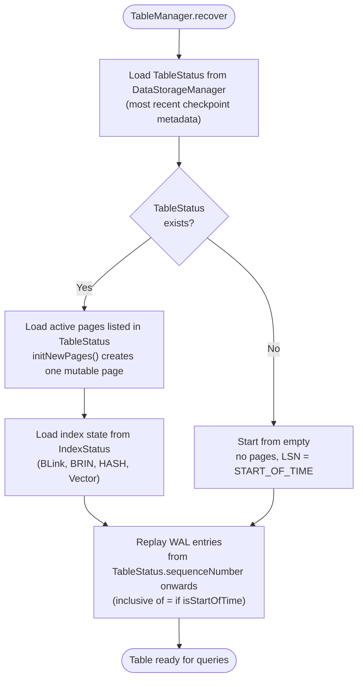

The `TableStatus.sequenceNumber` is the LSN captured in Phase A. All WAL entries
**after** this LSN are replayed. This includes:
- Rows inserted during Phase B (in the new `currentDirtyRecordsPage` or via transactions
  that committed after Phase A).
- Updates/deletes that failed the conditional `keyToPage.put` during compaction.
- Any DDL that ran during Phase B.

**Secondary index recovery**: Each index loads its last-checkpointed `IndexStatus`. Because
secondary index checkpoints run in Phase B (after the Phase A LSN is captured), an index
checkpoint may reflect a state slightly **ahead** of the Phase A LSN. WAL replay will
re-apply those index operations idempotently (insert/delete of a record that already
exists in the index is handled gracefully by each implementation).

---

## 12. Pinned Checkpoints

The `pin=true` flag is passed to `tableCheckpoint()` during dump operations. A pinned
checkpoint is never cleaned up by `PostCheckpointActions` until explicitly unpinned.

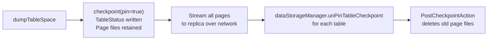

While the dump is in progress:
- Old page files referenced by the pinned checkpoint are **not** deleted even if a newer
  checkpoint has superseded them.
- Disk usage may temporarily increase significantly for large tables.
- The `pageReplacementPolicy` may evict in-memory pages during streaming; they are
  reloaded from disk on demand.
