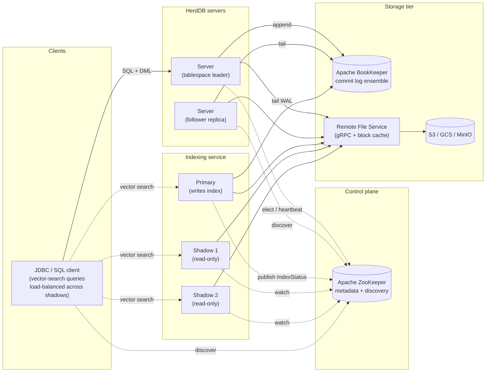
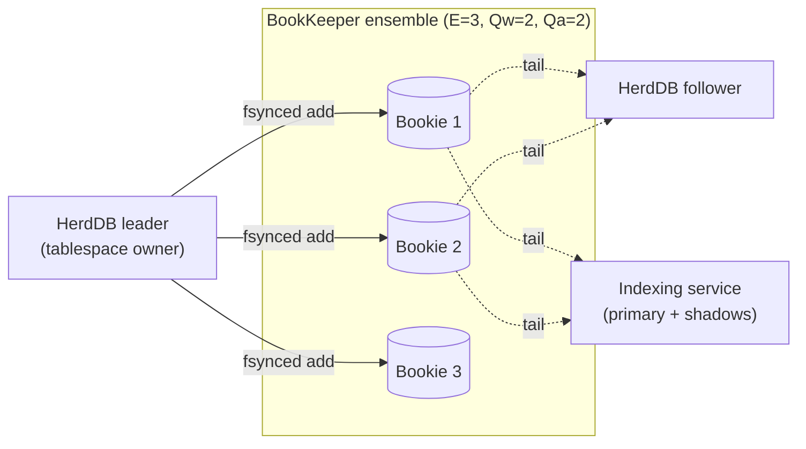
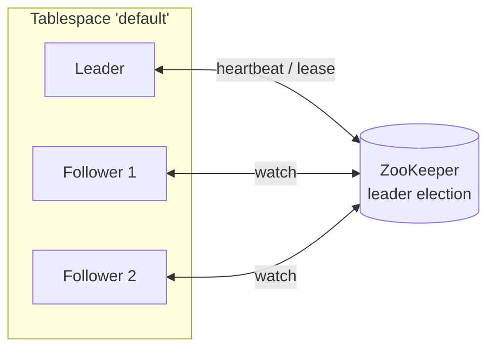
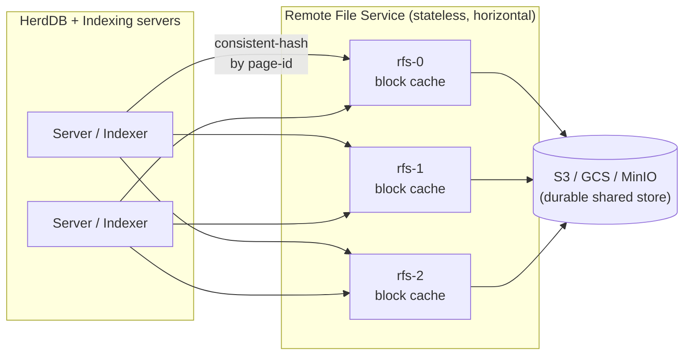
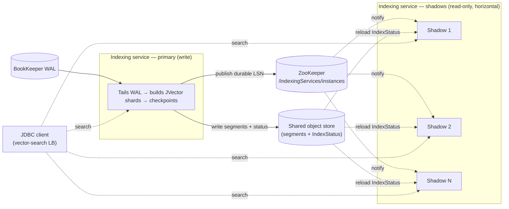

# HerdDB + JVector

*A horizontally scalable vector search database built on HerdDB, JVector,
Apache BookKeeper, Apache ZooKeeper and Apache Calcite.*

## Origins

This project started as a fork of [`diennea/herddb`](https://github.com/diennea/herddb)
— an embeddable, SQL-first distributed database — and has since evolved
independently. Focus has shifted toward **vector search at scale on
Kubernetes**: a standalone indexing service, shadow read replicas, and
object-store-backed shared storage have been added on top of the original
tablespace / WAL / checkpoint core.

The upstream project remains a separate codebase; this fork is not a
drop-in replacement and the two are no longer wire-compatible in all
configurations.

## Built on production-grade OSS

HerdDB + JVector does not reinvent the hard parts of a distributed
stateful system. It composes well-known, widely-deployed open-source
components:

| Component | Role | Version | Project |
|---|---|---|---|
| HerdDB core | SQL engine, WAL, tablespaces, checkpointing, BLink PK index | fork base | https://github.com/diennea/herddb |
| JVector (DataStax / IBM) | On-disk HNSW graph + Fused-PQ vector index | `4.0.0-rc.9-herddb` | https://github.com/datastax/jvector |
| Apache BookKeeper | Distributed, replicated, low-latency commit log | `4.17.3` | https://bookkeeper.apache.org |
| Apache ZooKeeper | Cluster metadata, tablespace leader election, instance discovery | `3.9.3` | https://zookeeper.apache.org |
| Apache Calcite | SQL parser and cost-based query planner | `1.40.0` | https://calcite.apache.org |

All of these are battle-tested in production at other projects; this
repository glues them together rather than re-implementing them.

## Cloud-native deployment

HerdDB + JVector is designed to run on **Kubernetes on public clouds**.

- **GKE** is currently the only environment actively tested end-to-end
  (via an in-repo benchmark harness — see [Agentic QA](#agentic-qa)
  below).
- The object-store code path uses the AWS SDK v2 S3 client, so **AWS
  S3** is expected to work with minor configuration changes; other
  S3-compatible stores (MinIO is used in local tests) have also been
  exercised.
- **Docker images** are built from [`herddb-docker/`](./herddb-docker/)
  (base image `eclipse-temurin:25-jdk`).
- A **Helm chart** plus ready-to-use `values.yaml` for GKE and for a
  local k3s-in-docker stack ships under
  [`herddb-kubernetes/src/main/helm/herddb/`](./herddb-kubernetes/src/main/helm/herddb/).

See [KUBERNETES.md](./KUBERNETES.md) for image build instructions and
chart usage.

## Architecture at a glance

The rest of this section zooms in on individual layers.

## Component deep-dives

### 1. Replicated commit log (BookKeeper)

The tablespace leader appends every DML and DDL to a BookKeeper ledger.
Followers — and the indexing service — tail the same ledger
independently, so a single logical WAL feeds both the SQL replica tier
and the vector indexing tier.

Ensemble, write-quorum and ack-quorum are tuned per deployment
(see the example `values.yaml` files). BookKeeper gives strong
durability and low write latency without requiring shared block
storage.

Details: [CHECKPOINT.md §2](./CHECKPOINT.md) describes how checkpoints
interact with the WAL and how commit-log truncation is coordinated.

### 2. Tablespace leader / follower replication

Data is grouped into **tablespaces**. Each tablespace has exactly one
leader at any point in time and any number of follower replicas,
elected via ZooKeeper.

**Two distinct read-scaling tiers — don't conflate them:**

- **Server follower replicas** exist primarily for **durability and
  fast failover**. They can serve SQL reads, but the client is
  responsible for picking which replica to hit; there is no built-in
  automatic fan-out of SQL reads across followers.
- **Indexing-service shadow replicas** (§4 below) are the tier that
  **does** transparently scale **vector-search read throughput**:
  the JDBC client load-balances each search query across
  `{primary, shadow1, shadow2, …}` for the target index.

### 3. Shared object storage + file-server cache tier

Table pages and vector segments are stored in a shared object store
(S3, GCS, MinIO). The **Remote File Service** is a stateless gRPC
tier that fronts the object store, routing page IDs across backends
with Murmur3 consistent hashing and caching recently-read segment
blocks in an off-heap, byte-weighted Caffeine LRU.

Because page content is immutable once written, the cache is trivially
coherent: the file-server tier can be scaled out horizontally, and
shadow replicas that hit the same hot working set benefit from warm
caches.

Details: [REMOTE_FILE_SERVER.md](./REMOTE_FILE_SERVER.md).

### 4. Indexing service: primary + shadow replicas

The indexing service is a standalone gRPC process. It **tails the
HerdDB WAL** independently of the database, materialising vector
indexes on its own schedule.

- The **primary** owns an index: it ingests DML from the WAL, builds
  live JVector shards, freezes them during checkpoint, writes on-disk
  segments (FusedPQ) to the shared Remote File Service, and publishes
  a new `IndexStatus` / durable LSN to ZooKeeper after every successful
  checkpoint.
- **Shadow replicas** are read-only siblings tied to a specific
  primary's `instanceId`. They watch the primary's state znode; when
  a new LSN is published, they reload `IndexStatus` from shared
  storage and serve search traffic against it. Shadows therefore
  lag the primary by **at most one checkpoint interval**.
- The **JDBC client** discovers instances via ZooKeeper and, for each
  vector-search query, **load-balances across `{primary, shadow1,
  shadow2, …}`** for the target index, failing over within the pool
  on `NOT_READY` or retryable errors.

Scope is strictly horizontal **read** scalability. Shadow-to-primary
promotion is explicitly out of scope, and shadows require
`indexing.storage.type=remote` (i.e. shared storage) — any other
configuration fails fast at boot.

Details: [VECTOR.md](./VECTOR.md) (architecture, SQL, shard
lifecycle), [VECTOR_SEARCH_METRICS.md](./VECTOR_SEARCH_METRICS.md)
(observability).

## Documentation index

All detailed documentation lives alongside the code in the repo root:

| Document | What it covers |
|---|---|
| [VECTOR.md](./VECTOR.md) | Vector index architecture, SQL syntax, indexing service, shard lifecycle, configuration. |
| [VECTOR_SEARCH_METRICS.md](./VECTOR_SEARCH_METRICS.md) | Prometheus metrics and Grafana dashboard for the end-to-end vector read path (server / index server / file server / client). |
| [CHECKPOINT.md](./CHECKPOINT.md) | Checkpoint phases (A / B / C), lock coupling with concurrent DML, per-index specifics, WAL truncation. |
| [BLINK.md](./BLINK.md) | Primary-key B-link tree: legacy vs incremental on-disk formats, recovery, selection flag. |
| [REMOTE_FILE_SERVER.md](./REMOTE_FILE_SERVER.md) | gRPC remote page storage, consistent hashing, metadata vs page layout, block cache. |
| [AUTHENTICATION.md](./AUTHENTICATION.md) | JDBC and gRPC auth mechanisms, including SASL OAUTHBEARER / OIDC JWT. |
| [KUBERNETES.md](./KUBERNETES.md) | Building Docker images, pushing to a registry, deploying via the Helm chart. |
| [CLAUDE.md](./CLAUDE.md) | Contributor guidelines — CI gates, hammer-test regression suite, exception-handling policy. |

## Agentic QA

Cluster-level regressions are caught by two Claude Code agent
definitions checked into the repository. Each one stands up a full
stack (HerdDB + indexing service + Remote File Service + BookKeeper +
ZooKeeper + object store) and runs a vector-search benchmark workload
end-to-end, producing a markdown report — or, on failure, opening a
GitHub issue with pod logs attached.

| Agent | Target | Object store |
|---|---|---|
| [`.claude/agents/herddb-k3s-bench.md`](./.claude/agents/herddb-k3s-bench.md) | local k3s-in-docker | MinIO |
| [`.claude/agents/herddb-gke-bench.md`](./.claude/agents/herddb-gke-bench.md) | existing GKE cluster | Google Cloud Storage |

These are developer-facing regression harnesses, not a user feature.
The underlying shell scripts they drive live under
[`herddb-kubernetes/src/main/helm/herddb/examples/`](./herddb-kubernetes/src/main/helm/herddb/examples/)
and can also be run by hand.

## Getting involved

Join the [mailing list](http://lists.herddb.org/mailman/listinfo).

## License

HerdDB + JVector is distributed under the
[Apache License 2.0](http://www.apache.org/licenses/LICENSE-2.0.html).
